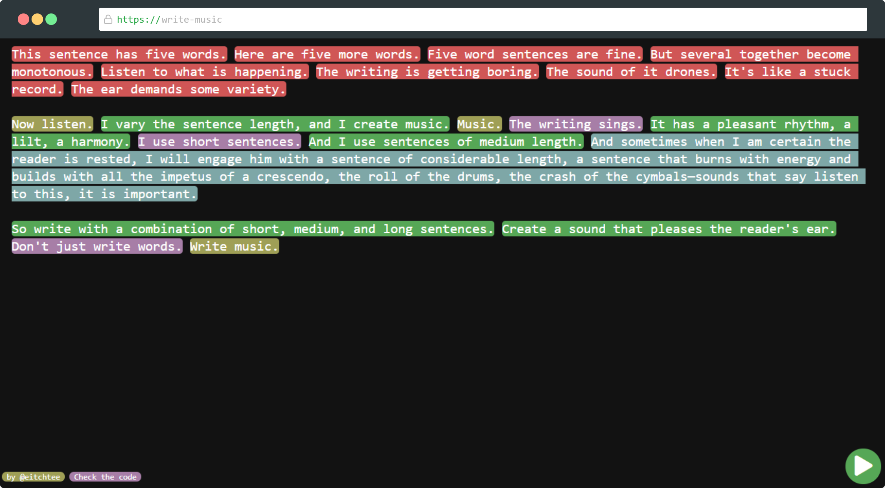
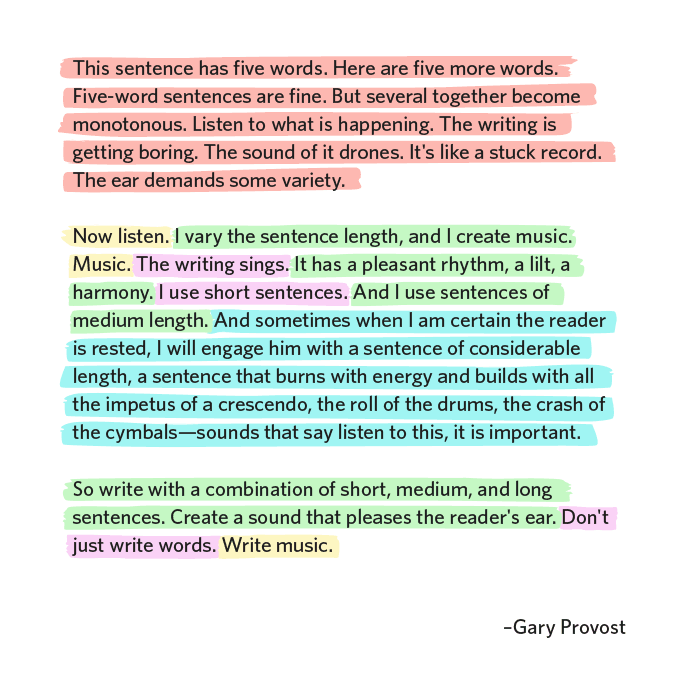

	

<h1 align="center">Write Music</h1>

See the rhythm of your text right on your browser.

  
  

 

---

    <a href="#whats-this">❓ What's this?</a> •
    <a href="#tech-stack">🛠️ Tech Stack</a> • 
    <a href="#development">✏️ Development</a>

## What's This?
Write Music is a simple browser tool for seeing and hearing your writing's reading rhythm, based on a [Gary Provost's](https://www.garyprovost.com/) writing tip which seems to be used by [Amazon's Marketing Team](https://medium.com/better-marketing/amazon-accidentally-sent-out-their-email-template-33e6ecbc0875).

**Everything is done in-browser and no data is stored or sent to a server.**

## Tech Stack

##### **Website**

-   **Pure HTML and CSS**
-   **[jQUery](https://jquery.com/)**
-   **[highlight-within-textarea](https://github.com/lonekorean/highlight-within-textarea)**

##### **Hosting**

-   **[Github Pages](https://pages.github.com/)**

##### **Tools**

-   _Editor_:  **[WebStorm](https://www.jetbrains.com/webstorm/)**

## Development

There are no special requirements.

Clone this repo and edit `index.html` and `script.js`

---

	

<code align="center">Write Music</code>

